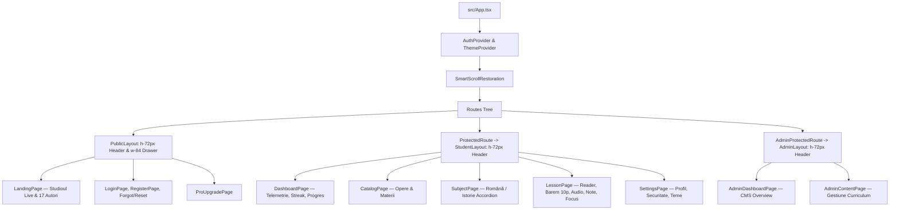

# PLATFORMA-BAC — CARTEA CANONICĂ DE ARHITECTURĂ, DESIGN SYSTEM & INFRASTRUCTURĂ TEHNICĂ
> **DOCUMENT STATUS:** CANONICAL & EXHAUSTIVE MASTER SPECIFICATION  
> **VERSIUNE:** 2.0-ULTRA-ENTERPRISE  
> **DATA ELABORĂRII:** August 2026  
> **DESTINAȚIE:** Documentația tehnică principală pentru dezvoltare, mentenanță, scalare și securitate

---

## CUPRINS DETALIAT

1. [Misiune, Filozofie Pedagogică & Profilul Utilizatorului](#1-misiune-filozofie-pedagogică--profilul-utilizatorului)
2. [Design System & Limbaj Vizual Exhaustiv](#2-design-system--limbaj-vizual-exhaustiv)
   - 2.1 [Paleta de Culori & Variabile Semantice (Dark & Light)](#21-paleta-de-culori--variabile-semantice-dark--light)
   - 2.2 [Tipografie, Ierarhie & Scală Editorială](#22-tipografie-ierarhie--scală-editorială)
   - 2.3 [Ierarhia Materialelor de Sticlă (Glassmorphism Hierarchy)](#23-ierarhia-materialelor-de-sticlă-glassmorphism-hierarchy)
   - 2.4 [Fizica Mișcării Ambientale (Organic Symbol Drift)](#24-fizica-mișcării-ambientale-organic-symbol-drift)
   - 2.5 [Sistemul Spectral de Skeleton Shimmer (`skeleton-premium`)](#25-sistemul-spectral-de-skeleton-shimmer-skeleton-premium)
   - 2.6 [Borduri Interactive, Light-Sweeps & Perimetre Luminoase](#26-borduri-interactive-light-sweeps--perimetre-luminoase)
3. [Arhitectură Frontend & Catalogul Complet al Componentelor](#3-arhitectură-frontend--catalogul-complet-al-componentelor)
   - 3.1 [Topologia Rutelor & Structura Layout-urilor Unificate (72px)](#31-topologia-rutelor--structura-layout-urilor-unificate-72px)
   - 3.2 [Mecanismul Smart Scroll Restoration](#32-mecanismul-smart-scroll-restoration)
   - 3.3 [Command Palette Global (`Ctrl+K` / `Cmd+K`)](#33-command-palette-global-ctrlk--cmdk)
   - 3.4 [Ecosistemul Cititorului de Manual Digital (`LessonPage`)](#34-ecosistemul-cititorului-de-manual-digital-lessonpage)
   - 3.5 [Blocurile Structurale de Conținut Educațional](#35-blocurile-structurale-de-conținut-educațional)
   - 3.6 [Dashboard-ul de Telemetrie & Ritmul de Studiu](#36-dashboard-ul-de-telemetrie--ritmul-de-studiu)
   - 3.7 [Modulul de Autentificare & Securitate Profil](#37-modulul-de-autentificare--securitate-profil)
4. [Infrastructură Backend & Arhitectură Supabase](#4-infrastructură-backend--arhitectură-supabase)
   - 4.1 [Schema Completă a Bazei de Date (12 Tabele)](#41-schema-completă-a-bazei-de-date-12-tabele)
   - 4.2 [Modelul de Securitate Row Level Security (RLS)](#42-modelul-de-securitate-row-level-security-rls)
   - 4.3 [Proceduri Stocate Atomice & Sigure (`SECURITY DEFINER`)](#43-proceduri-stocate-atomice--sigure-security-definer)
   - 4.4 [Sistemul de Roluri & Abonamente PRO](#44-sistemul-de-roluri--abonamente-pro)
5. [Cartografierea Programei Oficiale de Bacalaureat](#5-cartografierea-programei-oficiale-de-bacalaureat)
   - 5.1 [Cei 17 Autori Canonici & Operele de Limba Română](#51-cei-17-autori-canonici--operele-de-limba-română)
   - 5.2 [Pilonii Tematici de Istoria Românilor](#52-pilonii-tematici-de-istoria-românilor)
6. [Reguli de Producție, Invarianți & Bune Practici](#6-reguli-de-producție-invarianți--bune-practici)
7. [Ghid de Extindere & Roadmap Tehnic Viitor](#7-ghid-de-extindere--roadmap-tehnic-viitor)

---

## 1. MISIUNE, FILOZOFIE PEDAGOGICĂ & PROFILUL UTILIZATORULUI

### 1.1 Misiunea Platformei
**PlatformaBac** este concepută pentru a înlocui materialele de studiu învechite, culegerile indigeste și memorarea fără noimă printr-un **mediu de învățare digital modern, structurat și interactiv**, care ghidează elevul pas cu pas către obținerea notei maxime ($10.00$) la examenul național de Bacalaureat.

### 1.2 Profilul Utilizatorului-Țintă (Elevul de 10)
- Elevul din clasele a XI-a și a XII-a (filieră teoretică, vocațională sau tehnologică).
- Nevoi critice: structură logică a eseurilor, repere clare pe barem (fără divagații), recapitulări rapide prin sinteze audio și monitorizarea progresului pentru a evita panica dinaintea examenului.

### 1.3 Triada de Design a Platformei
1. **Estetică Editorială Premium:** Spațiul de învățare trebuie să inspire calm, claritate și respect pentru studiul academic (fără reclame, fără bannere agasante, fără zgomot vizual).
2. **Viteză & Fluiditate Instantanee:** Răspuns instantaneu la click, căutare globală în 0.1s, încărcare prin skeletoane spectrale personalizate.
3. **Conformitate 100% cu Baremul Ministerului:** Orice eseu și sinteză respectă la virgulă cele 4 repere fundamentale de punctaj.

---

## 2. DESIGN SYSTEM & LIMBAJ VIZUAL EXHAUSTIV

### 2.1 Paleta de Culori & Variabile Semantice (Dark & Light)

Aplicația folosește un sistem de culori adaptiv reglementat în `src/index.css` și `tailwind.config.js`:

```css
:root {
  /* DARK THEME (Default) */
  --color-background: #090d16;        /* Obsidian Canvas */
  --color-surface: #0f172a;           /* Deep Slate Card */
  --color-surface-elevated: #161f30;  /* Elevated Interactive Layer */
  --color-border: rgba(255, 255, 255, 0.08);
  --color-border-subtle: rgba(255, 255, 255, 0.04);
  --color-text: #f8fafc;              /* Slate 50 (High Contrast) */
  --color-text-muted: #94a3b8;        /* Slate 400 */
  --color-text-subtle: #64748b;       /* Slate 500 */
  
  /* ACCENT TOKENS */
  --color-cyan-primary: #06b6d4;      /* Electric Cyan */
  --color-cyan-glow: rgba(6, 182, 212, 0.35);
  --color-gold-primary: #f59e0b;      /* Academic Amber / PRO */
  --color-gold-glow: rgba(245, 158, 11, 0.30);
  --color-emerald-success: #10b981;   /* Status Success */
  --color-rose-danger: #ef4444;       /* Status Danger */
}

[data-theme='light'] {
  /* LIGHT THEME (Paper Editorial) */
  --color-background: #f8fafc;        /* Clean Editorial Paper */
  --color-surface: #ffffff;           /* Pure White */
  --color-surface-elevated: #f1f5f9;  /* Soft Slate 100 */
  --color-border: rgba(0, 0, 0, 0.08);
  --color-border-subtle: rgba(0, 0, 0, 0.04);
  --color-text: #090d16;              /* Deep Obsidian Ink */
  --color-text-muted: #475569;        /* Slate 600 */
  --color-text-subtle: #64748b;       /* Slate 500 */
  
  --color-cyan-primary: #0284c7;      /* Sky 600 (High Contrast in Light) */
  --color-gold-primary: #b45309;      /* Amber 700 (Legible in Light) */
  --color-emerald-success: #047857;   /* Emerald 700 */
  --color-rose-danger: #dc2626;       /* Rose 600 */
}
```

### 2.2 Tipografie, Ierarhie & Scală Editorială
- **Display & Headings:** `Outfit`, `Plus Jakarta Sans`, `Cinzel` (`font-display font-bold tracking-tight`).
- **Text Eseu & Citate:** `Source Serif 4`, `Merriweather` (`font-literary-serif leading-relaxed text-sm sm:text-base`).
- **Interfață Utilizator:** `Inter` (`font-sans font-medium text-xs sm:text-sm`).
- **Cod, URL-uri & Timp:** `JetBrains Mono` (`font-mono text-xs`).

### 2.3 Ierarhia Materialelor de Sticlă (Glassmorphism Hierarchy)
1. **`glass-subtle`:** `backdrop-blur-md bg-surface/40 border border-border/40` — pastile de context, tag-uri de materie.
2. **`glass-default`:** `backdrop-blur-xl bg-surface/60 border border-border/70` — carduri de catalog, liste de activitate.
3. **`glass-elevated`:** `backdrop-blur-2xl bg-surface/80 border border-border/80 shadow-subtle` — carduri principale, ferestre de studio, bare audio.
4. **`glass-featured`:** `backdrop-blur-3xl bg-surface/90 border border-cyan-500/30 shadow-[0_20px_60px_-15px_rgba(0,0,0,0.5)]` — rama de studio macOS, carduri hero.
5. **`glass-featured-pro`:** `backdrop-blur-3xl bg-surface/90 border border-amber-500/40 shadow-[0_0_30px_rgba(245,158,11,0.15)]` — carduri exclusive PRO.
6. **`glass-floating`:** `backdrop-blur-xl bg-background/85 border-b border-border/80 shadow-md` — Headerul sticky superior.

### 2.4 Fizica Mișcării Ambientale (Organic Symbol Drift)
În componenta `src/components/ui/AmbientBackground.tsx`, 24 de simboluri științifice și umaniste plutesc asincron:
- **Simboluri incluse:** $\int$, $\pi$, $\infty$, $\Sigma$, $\partial$, $\mathfrak{R}$, $\mathcal{L}$, $\aleph$, $\Xi$, $\Phi$, $\Delta$, $\nabla$, $\Psi$, $\Omega$, $\sqrt{x}$, $\lambda$.
- **Trei vectori de mișcare:**
  - `animate-ambient-1`: ciclu de 18s cu scalare de la $1.0$ la $1.08$ și translație $(-20\text{px}, 25\text{px})$.
  - `animate-ambient-2`: ciclu de 23s cu scalare de la $0.95$ la $1.04$ și translație $(25\text{px}, -30\text{px})$.
  - `animate-ambient-3`: ciclu de 28s cu scalare de la $1.0$ la $1.06$ și translație $(30\text{px}, 35\text{px})$.
- **Opacitate calibrată:** $0.06 - 0.12$, asigurând zero interferențe cu lizibilitatea textului.

### 2.5 Sistemul Spectral de Skeleton Shimmer (`skeleton-premium`)
```css
@keyframes skeletonWave {
  0% { background-position: -200% 0; }
  100% { background-position: 200% 0; }
}
.skeleton-premium {
  position: relative;
  overflow: hidden;
  background: var(--color-surface-elevated, #161f30);
}
.skeleton-premium::after {
  content: '';
  position: absolute;
  inset: 0;
  background: linear-gradient(
    90deg,
    transparent 0%,
    rgba(6, 182, 212, 0.06) 35%,
    rgba(255, 255, 255, 0.12) 50%,
    rgba(6, 182, 212, 0.06) 65%,
    transparent 100%
  );
  background-size: 200% 100%;
  animation: skeletonWave 2.2s infinite ease-in-out;
}
```

---

## 3. ARHITECTURĂ FRONTEND & CATALOGUL COMPLET AL COMPONENTELOR

### 3.1 Topologia Rutelor & Structura Layout-urilor Unificate (72px)
Toate layout-urile (`PublicLayout`, `StudentLayout`, `AdminLayout`) partajează un **header orizontal unificat de $72\text{px}$** (`h-[72px]`), eliminând discontinuitățile vizuale:



### 3.2 Mecanismul Smart Scroll Restoration
Componenta `src/components/ui/SmartScrollRestoration.tsx`:
1. **Navigare Nouă (`PUSH`):** Execută `window.scrollTo({ top: 0, left: 0, behavior: 'instant' })`.
2. **Navigare Istoric (`POP` - Buton Back / Forward):** Salvează `window.scrollY` pe cheia `location.key` și la revenire poziționează utilizatorul cu precizie de pixeli prin dublu `requestAnimationFrame`.
3. **Ancore Hash (`#living-studio`):** Execută derularea lină direct la elementul țintă.

### 3.3 Command Palette Global (`Ctrl+K` / `Cmd+K`)
Componenta `src/components/ui/CommandPalette.tsx`:
- Indexează în memorie toți cei **17 autori canonici**, operele majore, sintezele de Istorie, rutele principale și comutatorul de temă Dark/Light.
- Căutare instantanee cu potrivire de caractere și evidențierea categoriei.
- Navigare din tastatură cu tastele `↑`, `↓`, `Enter` și `ESC`.

### 3.4 Ecosistemul Cititorului de Manual Digital (`LessonPage`)
Echipat cu 5 module integrate:
1. **`ScrollProgressBar.tsx`:** Bară subțire superioară (`h-1 bg-cyan-400`) care indică procentul parcurs din eseu.
2. **`Modul Focus`:** Buton care extinde containerul la `max-w-3xl`, mărind fontul și ascunzând distragerile.
3. **`LessonAudioBar.tsx`:** Player audio cu 5 bare animate de frecvență (`soundWave`), cronometru și viteză comutabilă ($0.75\text{x}$, $1\text{x}$, $1.25\text{x}$, $1.5\text{x}$).
4. **`LessonBaremChecklist.tsx`:** Simulator de autoevaluare pe barem oficial (4 criterii = 10 puncte) cu calcul instant de notă.
5. **`LessonStudyNotes.tsx`:** Carnet de notițe per lecție cu salvare automată și opțiune de copiere pe clipboard.

### 3.5 Blocurile Structurale de Conținut Educațional
Rendate prin `src/components/lesson/LessonBlockRenderer.tsx`:
- **`RichTextBlock`:** Paragrafe de eseu cu stil editorial și contrast curat.
- **`DefinitionBlock`:** Casete cu bordură albastră/cyan pentru concepte operaționale și termeni literari.
- **`ImportantBlock`:** Casete cu bordură chihlimbar/aurie pentru repere critice de notare pe barem.
- **`RememberBlock`:** Casete cu bordură violet/indigo pentru scheme de memorare și corelații.
- **`SummaryBlock`:** Casete cu bordură verde/smarald pentru concluzii și idei de sinteză.

---

## 4. INFRASTRUCTURĂ BACKEND & ARHITECTURĂ SUPABASE

### 4.1 Schema Completă a Bazei de Date (12 Tabele)

```sql
-- 1. Materii de Bacalaureat
CREATE TABLE public.subjects (
  id uuid PRIMARY KEY DEFAULT gen_random_uuid(),
  name text NOT NULL,
  slug text UNIQUE NOT NULL,
  description text,
  short_description text,
  icon_name text DEFAULT 'BookOpen',
  accent_color text DEFAULT 'cyan',
  sort_order integer DEFAULT 0,
  is_published boolean DEFAULT true,
  created_at timestamptz DEFAULT now()
);

-- 2. Capitole / Opere Literare
CREATE TABLE public.chapters (
  id uuid PRIMARY KEY DEFAULT gen_random_uuid(),
  subject_id uuid REFERENCES public.subjects(id) ON DELETE CASCADE,
  title text NOT NULL,
  slug text NOT NULL,
  short_description text,
  sort_order integer DEFAULT 0,
  is_published boolean DEFAULT true,
  metadata jsonb DEFAULT '{}'::jsonb,
  created_at timestamptz DEFAULT now(),
  UNIQUE (subject_id, slug)
);

-- 3. Lecții & Eseuri
CREATE TABLE public.lessons (
  id uuid PRIMARY KEY DEFAULT gen_random_uuid(),
  chapter_id uuid REFERENCES public.chapters(id) ON DELETE CASCADE,
  title text NOT NULL,
  slug text NOT NULL,
  short_description text,
  estimated_minutes integer DEFAULT 10,
  access_level text DEFAULT 'free' CHECK (access_level IN ('free', 'pro')),
  cover_media_id uuid,
  sort_order integer DEFAULT 0,
  status text DEFAULT 'draft' CHECK (status IN ('draft', 'published', 'archived')),
  published_at timestamptz,
  created_at timestamptz DEFAULT now(),
  updated_at timestamptz DEFAULT now(),
  UNIQUE (chapter_id, slug)
);

-- 4. Blocuri de Conținut Lecție
CREATE TABLE public.lesson_blocks (
  id uuid PRIMARY KEY DEFAULT gen_random_uuid(),
  lesson_id uuid REFERENCES public.lessons(id) ON DELETE CASCADE,
  block_type text NOT NULL CHECK (block_type IN ('rich_text', 'definition', 'important', 'remember', 'summary', 'quote')),
  content jsonb NOT NULL,
  sort_order integer DEFAULT 0,
  is_required_for_completion boolean DEFAULT true,
  created_at timestamptz DEFAULT now()
);

-- 5. Progres Elev pe Lecție
CREATE TABLE public.lesson_progress (
  id uuid PRIMARY KEY DEFAULT gen_random_uuid(),
  user_id uuid REFERENCES auth.users(id) ON DELETE CASCADE,
  lesson_id uuid REFERENCES public.lessons(id) ON DELETE CASCADE,
  status text DEFAULT 'not_started' CHECK (status IN ('not_started', 'in_progress', 'completed')),
  progress_percent integer DEFAULT 0 CHECK (progress_percent BETWEEN 0 AND 100),
  last_block_id uuid,
  started_at timestamptz DEFAULT now(),
  completed_at timestamptz,
  updated_at timestamptz DEFAULT now(),
  UNIQUE (user_id, lesson_id)
);

-- 6. Streak & Ritm Zilnic de Studiu
CREATE TABLE public.user_streaks (
  user_id uuid PRIMARY KEY REFERENCES auth.users(id) ON DELETE CASCADE,
  current_streak integer DEFAULT 0,
  longest_streak integer DEFAULT 0,
  last_activity_date date,
  updated_at timestamptz DEFAULT now()
);

-- 7. Roluri & Staff
CREATE TABLE public.user_roles (
  id uuid PRIMARY KEY DEFAULT gen_random_uuid(),
  user_id uuid REFERENCES auth.users(id) ON DELETE CASCADE,
  role text NOT NULL CHECK (role IN ('student', 'editor', 'reviewer', 'super_admin')),
  created_at timestamptz DEFAULT now(),
  UNIQUE (user_id, role)
);

-- 8. Abonamente PRO (Stripe)
CREATE TABLE public.subscriptions (
  id uuid PRIMARY KEY DEFAULT gen_random_uuid(),
  user_id uuid REFERENCES auth.users(id) ON DELETE CASCADE,
  stripe_subscription_id text UNIQUE,
  plan text NOT NULL DEFAULT 'free' CHECK (plan IN ('free', 'pro')),
  status text NOT NULL DEFAULT 'inactive' CHECK (status IN ('active', 'trialing', 'past_due', 'canceled', 'incomplete', 'inactive')),
  current_period_end timestamptz,
  created_at timestamptz DEFAULT now(),
  updated_at timestamptz DEFAULT now()
);
```

### 4.2 Modelul de Securitate Row Level Security (RLS)
- **Regula de Descoperire (Rule 1):** Orice vizitator poate interoga materiile, capitolele și metadatele lecțiilor publicate (`id, title, slug, short_description, access_level, estimated_minutes`).
- **Regula de Protecție a Conținutului (Rule 2):** Conținutul efectiv din `lesson_blocks` este livrat prin RLS exclusiv dacă:
  1. Lecția are `access_level = 'free'`; SAU
  2. Utilizatorul are un abonament `pro` cu `status IN ('active', 'trialing')`; SAU
  3. Utilizatorul are un rol de staff (`editor`, `reviewer`, `super_admin`).
- **Izolare Totală a Datelor:** `lesson_progress`, `user_streaks`, `user_activity_logs` sunt protejate prin clauza `WHERE auth.uid() = user_id`.

### 4.3 Proceduri Stocate Atomice & Sigure (`SECURITY DEFINER`)
Procedura **`public.record_lesson_progress`** este nucleul operațional de progres:
- Rulează cu `SET search_path = public, private, auth, pg_temp` (elimină vulnerabilitățile de search path).
- Validează apartenența blocului la lecție.
- Garantează **non-regresia progresului** (`GREATEST(existing, new)`).
- Actualizează **streak-ul zilnic în mod atomic și idempotent** (o singură incrementare pe zi calendaristică).

---

## 5. CARTOGRAFIEREA PROGRAMEI OFICIALE DE BACALAUREAT

### 5.1 Cei 17 Autori Canonici & Operele de Limba Română

| Autor Canonic | Operă Reprezentativă | Curent / Specie Literară |
| :--- | :--- | :--- |
| **Mihai Eminescu** | *Luceafărul*, *Floare albastră* | Romantism / Poem filozofic |
| **Ion Creangă** | *Povestea lui Harap-Alb* | Realism / Basm cult (Bildungsroman) |
| **I.L. Caragiale** | *O scrisoare pierdută* | Realism clasic / Comedie de moravuri |
| **Ioan Slavici** | *Moara cu noroc* | Realism clasic / Nuvelă psihologică |
| **George Bacovia** | *Plumb*, *Lacustră* | Simbolism / Poezie simbolistă |
| **Lucian Blaga** | *Eu nu strivesc corola de minuni a lumii* | Modernism expresionist / Artă poetică |
| **Tudor Arghezi** | *Testament*, *Flori de mucigai* | Modernism / Estetica urâtului |
| **Ion Barbu** | *Riga Crypto și lapona Enigel*, *Din ceas, dedus...* | Modernism ermetic / Baladă |
| **Liviu Rebreanu** | *Ion*, *Pădurea spânzuraților* | Realism obiectiv / Roman interbelic |
| **Camil Petrescu** | *Ultima noapte de dragoste...*, *Patul lui Procust* | Modernism / Roman al experienței |
| **George Călinescu** | *Enigma Otiliei* | Balzacianism / Realism clasic |
| **Marin Preda** | *Moromeții*, *Cel mai iubit dintre pământeni* | Realism postbelic / Roman postbelic |
| **Nichita Stănescu** | *În dulcele stil clasic*, *Leoaică tânără, iubirea* | Neomodernism / Poezie |
| **Marin Sorescu** | *Iona* | Neomodernism / Teatru parabolă |
| **Mircea Eliade** | *Maitreyi*, *La țigănci* | Romanul experienței / Fantastic |
| **Vasile Voiculescu** | *În grădina Ghetsimani*, *Lostrița* | Tradiționalism / Povestire |
| **Costache Negruzzi** | *Alexandru Lăpușneanul* | Romantism / Nuvelă istorică |

### 5.2 Pilonii Tematici de Istoria Românilor
1. **Romanitatea românilor în viziunea istoricilor** (Teoria imigraționistă vs Continuitatea daco-romană, izvoare bizantine).
2. **Secolul al XX-lea între democrație și totalitarism** (Constituțiile din 1866, 1923, 1938, 1948, 1965, 1991).
3. **Statul român modern: de la proiect politic la România Mare** (1848, 1859, 1877, 1918).
4. **România în perioada Războiului Rece & Regimul Comunist** (Stalinism, Dej, Ceaușescu, Revoluția din 1989).
5. **Autonomii locale și instituții centrale în spațiul românesc** (Secolele IX–XIV).

---

## 6. REGULI DE PRODUCȚIE, INVARIANȚI & BUNE PRACTICI

> [!IMPORTANT]
> Toate modificările viitoare trebuie să se supună strict următoarelor principii:

1. **Zero Git Commits / Zero Pushes:** AI-ul nu realizează commit-uri sau push-uri în repository fără cererea explicită a utilizatorului.
2. **Stabilitatea Autentificării:** Logica de sesiune din `src/context/AuthContext.tsx` și rolurile din baza de date sunt imutabile fără audit prealabil.
3. **Regula de Contrast în Light Mode:**
   - Textul din Light Mode trebuie să respecte raportul de contrast WCAG AAA ($\ge 7:1$).
   - Sunt interzise culorile galben pal sau alb pe fundal deschis.
4. **Verificare TypeScript & Build:** Orice modificare necesită rularea `npm run typecheck` (`tsc -b`) și obținerea codului de ieșire `0`.
5. **Performanță & Bundling:** Păstrarea timpului de build sub $7\text{s}$ și utilizarea code-splitting-ului unde este necesar.

---

## 7. GHID DE EXTINDERE & ROADMAP TEHNIC VIITOR

### 7.1 Corector AI de Eseuri pe Barem Oficial (AI Grading Assistant)
- **Concept:** Elevul introduce propriul eseu redactat; un model AI (Gemini 1.5 Pro / Flash) analizează textul pe cele 4 repere de barem și generează o grilă de notare cu punctaj detaliat și sugestii concrete de îmbunătățire.
- **Implementare:** Supabase Edge Function securizată cu streaming SSE direct în interfață.

### 7.2 Modul de Flashcards cu Repetare Spațiată (Spaced Repetition)
- Algoritm SM-2 (SuperMemo 2) pentru memorarea anilor istorici, a citatelor și a trăsăturilor de curente literare.

### 7.3 Export PDF Editorial & Tipărire Curată
- Generare de PDF-uri de înaltă rezoluție folosind layout-ul editorial `@media print` pentru studiu offline pe hârtie.

### 7.4 Narare Vocală Neuronală Reală (Studio Audio Sync)
- Sincronizarea eseurilor cu fișiere audio masterizate profesional stocate în Supabase Storage (`media_assets`), cu evidențierea textului în timp real pe măsură ce este narat.

---

*Această documentație constituie specificația tehnică oficială și completă a platformei PlatformaBac.*
