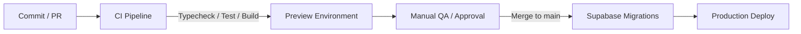

# CI/CD Pipeline, Migration Discipline & Environment Specification

## 1. Flow Canon: `commit → CI → preview → approval → production`



### Reguli Principale:
1. **CI Blocking Gate:** Nicio modificare nu poate ajunge în `main` dacă pică:
   - `pnpm typecheck` (`tsc -b`)
   - `pnpm test` (toate cele 23 de suite / 115 scenarii)
   - `pnpm build` (`vite build`)
2. **Fără Secrets în Repo:** Cheile senzitive (`SUPABASE_ACCESS_TOKEN`, `SUPABASE_DB_PASSWORD`, `SERVICE_ROLE_KEY`) se stochează exclusiv în **GitHub Repository Secrets** și se injectează în timpul rulării pipeline-ului.

---

## 2. Separarea Mediilor (Environment Separation)

| MEDIU | DOMENIU / URL | BAZĂ DE DATE SUPABASE | OBIECTIV & CONȚINUT |
| :--- | :--- | :--- | :--- |
| **Development** | `http://localhost:5173` | Local Supabase Docker / Staging Project | Dezvoltare locală feature-uri și teste unitare. |
| **Preview / Staging** | `https://preview-*.platforma-bac.pages.dev` | Staging Supabase DB (izolată) | Verificare manuală QA, vizualizare PR-uri, testare de integrare. |
| **Production** | `https://platforma-bac.ro` | Production Supabase DB | Acces elevi reali, SSL enforced, RLS strict. |

---

## 3. Disciplină de Migrare Supabase (Zero-Downtime Migration Discipline)

1. **Forward-Compatible Schema Changes:** Toate modificările de schemă SQL trebuie să fie compatibile cu versiunea anterioară de cod frontend (*non-breaking*).
   - Adăugările de coloane noi se fac obligatoriu cu `NULLABLE` sau `DEFAULT`.
   - Ștergerea sau redenumirea coloanelor se face în 2 faze (Deprecate $\rightarrow$ Remove).
2. **Rularea Migrărilor:** Migrările din folderul `supabase/migrations/*.sql` se aplică în mediul de Staging mai întâi, iar în Production se aplică automat în pipeline-ul `cd.yml` folosind `supabase db push` înainte de deploy-ul noului bundle frontend.

---

## 4. Strategie de Rollback (Rollback Strategy)

1. **Frontend Rollback:** În cazul în care o problemă neprevăzută apare în producție, se execută instant *Revert Commit* sau redeploy direct al ultimului artefact dist valabil din Cloudflare Pages / Vercel ($\le 30$ secunde).
2. **Database Rollback:** Fiecărui fișier de migrare `supabase/migrations/<timestamp>_feature.sql` îi corespunde o instrucțiune inversă documentată. Datorită disciplinei *Forward-Compatible*, schema rămâne compatibilă cu codul anterior în caz de rollback frontend.

---

## 5. Ghid de Configurare GitHub Secrets

Setează următoarele variabile în repository: `Settings -> Secrets and variables -> Actions`:

```env
# Staging / Preview
STAGING_SUPABASE_URL=https://<staging-id>.supabase.co
STAGING_SUPABASE_ANON_KEY=eyJhbGciOi...

# Production
PRODUCTION_SUPABASE_URL=https://<prod-id>.supabase.co
PRODUCTION_SUPABASE_ANON_KEY=eyJhbGciOi...

# Database Migration Token
SUPABASE_ACCESS_TOKEN=sbp_...
SUPABASE_DB_PASSWORD=...
```
